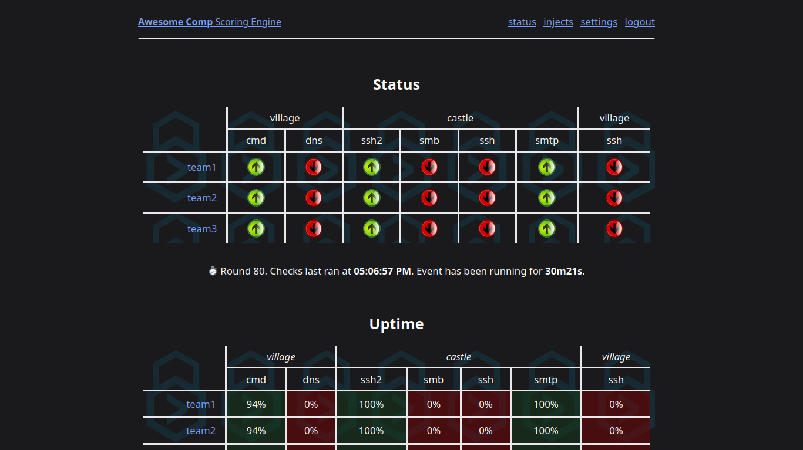

DWAYNE-INATOR-5000 scoring engine
=================================

A truly euphoric competition scoring engine experience: the DWAYNE-INATOR-5000.


Usage
-----

1. Download this repository (`git clone https://github.com/DSU-DefSec/DWAYNE-INATOR-5000`).
2. Compile the code (`cd DWAYNE-INATOR-5000; go build`).
   - Unfortunately, you need `gcc` for `go-sqlite3`.
3. Save your configuration as `./dwayne.conf`.
4. Run the engine (`./DWAYNE-INATOR-5000`).

Screenshots
-----------




Configuration
-------------

Anything you leave blank will be default. Example configuration (`dwayne.conf`):

```toml
# Event title
event = "Awesome Comp"

# Show more info to competitors
verbose = true 

# Engine settings
timezone = "America/Rainy_River"   # Timezone you want to use
dbpath = ""                        # Path to sqlite3 database (default "dwayne.db")
injectapikey = "superSecretKey1!"  # API key for remotely adding injects
# https = true                       # Enable HTTPS
# port = 443                         # Port to listen on
# cert = "/root/cert.pem"            # Path to cert file
# key = "/root/key.pem"              # Path to key file
# disableheadtohead = true           # Hide head to head stats (other than current service status) between competitors
# startpaused = true                 # Start the competition paused

# Timing settings
delay = 20               # delay (seconds) between checks (>0) (default 60)
                             # note: the "real" max delay will be timeout+delay+jitter
jitter = 3               # jitter (seconds) between rounds (0<jitter<delay)
timeout = 5              # check timeout (must be smaller than delay-jitter)
servicepoints = 10       # how many points each up check is worth
slathreshold = 6         # how many checks before incurring SLA violation
slapoints = 13           # how many points is an SLA penalty (default slathreshold * 2)

# Mode settings
nopasswords = false      # disables password change requests (like CyberPatriot NSMC)
                             # note: some checks do not support being anonymous.
                             # for example, anonymous ssh wouldn't test anything.
                             # so, you can use a tcp check and just name it 'ssh'.
easypcr = true           # allow easy password changes
disableinfopage = true   # disable the "info" page on the nav header
persists = false         # run in cyberconquest mode (purple team events)

uptime = false           # add client uptime checking (clients must hit /update)
uptimesla = 10           # if uptime, how many minutes can a machine be down before SLA penalty
                             # this SLA value stacks, for example, twenty minutes down is two SLAs

# Admins have access to all records and information.
# You need at least one admin.
[[admin]]
name = "admin"
pw = "coolpass"

# Each team added here will show up on the scoreboard
# You need at least one team.
[[team]]
ip = "1"
pw = "Team1Pw!"

[[team]]
ip = "2"
pw = "AppleSauce"

# Credlists allow you to have different users for different services
# If none is specified, the first cred list in the config will be used as default
[[creds]]
name = "users"
usernames = ["john", "hiss", "richard", "sheriff", "captain", "guards", "otto", "rabbits", "skippy", "tagalong", "kluck", "toby"]
defaultpw = "Password1!"

# Teams are permitted to change passwords for any user
# But they can not change usernames or add new ones
[[creds]]
name = "admins"
usernames = ["robin", "dale", "tuck"]
defaultpw = "Password1!"

[[creds]]
name = "database"
usernames = ["wordpress",]
defaultpw = "Password2@"

# Box configurations

[[box]]
name="castle"
ip = "10.20.x.1"

    # If you want to keep something default, just don't specify it
    # For this box, we're running default SMB and SSH login checks
    [[box.smb]]
    [[box.ssh]]


[[box]]
name = "village"
ip = "10.20.x.2"

    # Run command with sh, compare output against regex.
    # Command must return exit code 0 to pass.
    [[box.cmd]]
    # BOXIP and USERNAME and PASSWORD are replaced with their values when run
    command = "python3 ./test.py BOXIP USERNAME PASSWORD" # Keywords not required
    regex = "success"

    # If you omit a value, it is set to the default
    # For example, if I removed the line port = 4000,
    # the check port would be 53
    [[box.dns]]
    port = 4000 # default 53
        [[box.dns.record]]
        kind = "A" # DNS record type
        domain = "townsquare.sherwood.lan" # Domain query
        answer = ["192.168.1.4",] # List of acceptable answers

        [[box.dns.record]]
        kind = "MX"
        domain = "sherwood.lan"
        answer = ["192.168.1.5", "10.20.1.5"]

    [[box.ftp]]
    port = 55 # default 21
    anonymous = true # default false

        [[box.ftp.file]]
        name = "memo.txt" # file to retrieve
        hash = "9d8453505bdc6f269678e16b3e56c2a2948a41f2c792617cc9611ed363c95b63" # sha256 sum to compare to

        # When multiple files are passed, one is randomly chosen
        # This pattern persists for any multi-item check
        [[box.ftp.file]]
        name = "workfiles.txt" # file to retrieve
        regex = "work.*work" # regex to test against file
    
    [[box.imap]]
    port = 33 # default 143
    encrypted = true # default false

    [[box.ldap]]
    port = 222 # default 636;
    encrypted = true # default false
    domain = "sherwood.lan"

    [[box.ping]]
    count = 3 # default 1
    allowpacketloss = true # default false
    percent = 50 # max percent packet loss

    # Note: RDP is nonfunctional until a good go RDP library is written, or I write one
    [[box.rdp]]
    port = 3389

    [[box.smb]]
    credlists = ["admins",] # for any check using credentials, you can specify the list
    port = 55 # default 21
    anonymous = true # default false

        [[box.smb.file]]
        name = "memo.txt"
        hash = "9d8453505bdc6f269678e16b3e56c2a2948a41f2c792617cc9611ed363c95b63"

        [[box.smb.file]]
        name = "workfiles.txt"
        regex = "work.*work"

    [[box.smtp]]
    encrypted = false # default false
    sender = "hello@scoring.engine"
    receiver = "tuck@sherwood.lan"
    body = "howdy, friar! he's about to have an outlaw for an inlaw!"

    [[box.sql]]
    kind = "mysql" # default mysql

        [[box.sql.query]]
        contains = true
        database = "wordpress"
        table = "users"
        column = "username"
        output = "Tuck"
        
        [[box.sql.query]]
        database = "squirrelmail"
        table = "senders"
        column = "name"
        output = "Toby Turtle" # Must match exactly

        [[box.sql.query]]
        database = "wordpress"
        databaseexists = true # simply checks if database exists with "show databases;"

    [[box.ssh]]
    display = "remote"         # you can set the display name for any check
    privkey = "village_sshkey" # name of private key in checkfiles/

    [[box.ssh]]
    badattempts = 2
    port = 2222

        [[box.ssh.command]]
        command = "cat /etc/passwd"
        contains = true
        output = "robin:"

        [[box.ssh.command]]
        useregex = true
        command = "getent `id`"
        output = '\w.*:[1-9].*:.*'

    [[box.tcp]] # the most simple check. check tcp connect
    port = 4444

    [[box.vnc]]
    port = 5901

    [[box.web]]
    display = "ecom"
    credlists = ["web",]

        [[box.web.url]]
        path = "/joomla"
        regex = ".*easy to get started creating your website.*"

        [[box.web.url]]
        path="/wp-admin.php"
        usernameparam = "user"
        passwordparam = "pw"
        status = 302

    [[box.web]]
    port = 8006
    scheme = "https"
        
        [[box.web.url]]
        # defaults to successful page retrieval

    [[box.winrm]]
    badattempts = 1
    encrypted = true

        [[box.winrm.command]]
        command = "Get-FileContent memo.txt"
        contains = true
        output = "business as usual in the kingdom!"
```

Note that for both the `uptime` and `persist` feature, the boxes are required to access the scoring engine at their config-assigned IP. For example, `persist` won't work if you're accessing the scoring engine through a reverse proxy and it can't tell what the real local source IP is.

Injects
-------

Put your injects into  `injects.conf`. Note that the engine will only load injects from this file if you don't already have any injects loaded into the database (e.g., from a previous run of the engine). If you do and you want to re-load these injects, you need to delete your existing injects, either through the web interface or by deleting the entire database.

Place PDFs or anything you link as `file = ` into the `./injects` folder. 

Times in the config are given in HH:MM:SS from the start of the competition. Go to settings in order to reset scoring data (including start time). Only the open time (`time = ...`) can be set to a zero value.

Example injects config:

```toml
[[inject]]
title = "Management Request" 
body = "We want to add a user to all Linux machines."
file = "mgmtreq1.pdf" 
time = 00:00:00
due = 02:00:00
closes = 04:00:00
points = 500

[[inject]]
title="Extraterrestrial Sighting on WAN1" 
body = "Jimmy from accounting snapped this picture. Can you tell us what's in this image?"
file = "ET.pdf" 
time = 00:05:00
due = 01:00:00
closes = 04:00:00
points = 250
```

Adding Scoring Checks Mid-Competition
-----------------------------

Add boxes and checks that you want to occur mid-competition to the `delayed-checks.conf` file.

If the box already exists, ensure that you use the same IP, and the checks will be appended to the existing box.

Example `delayed-checks.conf`:

```toml
[[box]]
name = "castle"
ip = "10.20.x.1"

# This field is the critical component.
# Specify a time after the competition has begun in 
# HH:MM:SS that you  want the checks to appear.
# This works just like injects.
time = 00:00:20

    [[box.cmd]]
    display = "new-command"
    cmd = "ls -Ral"
```


Purple Team "Perist Mode" Scoring Algorithm
-------------------------------------------

In persist mode, like normal, a box receives points for successfully completing a service check. However, those points are distributed equally between the owner of the box and all those who persisted on it.

For example:

1. Castle (6 from castle-ssh and 6 from castle-ftp) receives 12 points for uptime (configurable values).
2. There are two teams who had persistence on that machine in that check.
3. Each team receives 4 (12 divided by 3) points.

It is thus impossible to get points if all a box's services are down. This is mean to disincentivize nuking boxes and services, and incentivize careful securing of services from the defender's perspective (since they still get points if it's green and persisted, but not if it's offline).

Notes
---------------
Thanks to the [scorestack](https://github.com/scorestack/scorestack/) project for some check code.
